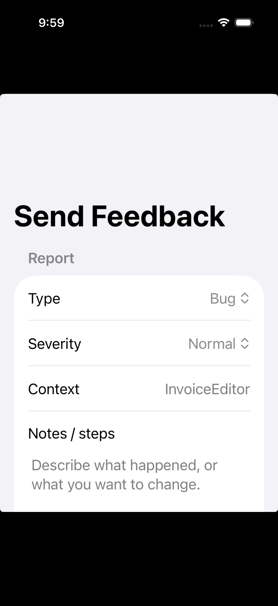

# iOS SwiftUI example

This example app is a tiny UI harness for the reusable form. It uses an injected transport stub so the submission flow can be exercised without talking to GitHub.

```swift
import AppReportKit
import AppReportKitUI
import SwiftUI

struct SupportView: View {
    private let client = AppReportClient(
        endpointURL: URL(string: "https://reports.example.com/v1/report")!,
        appId: "justcards",
        bearerToken: "EXAMPLE_APP_REPORT_KEY",
        diagnosticsProvider: ExampleDiagnosticsProvider(),
        transport: ExampleTransport()
    )

    var body: some View {
        FeedbackForm(
            client: client,
            initialKind: .bug,
            showsSeverityPicker: true,
            screenContext: "InvoiceEditor"
        )
    }
}

struct ExampleDiagnosticsProvider: FeedbackDiagnosticsProvider {
    func makeDiagnostics() -> [String: String] {
        [
            "lastAction": "Tapped Export"
        ]
    }
}
```

The Xcode project for the example lives next to this README and the UI tests run on an iPhone 17 Pro simulator destination.

## Snapshot

The UI test saves a PNG artifact here:

`Screenshots/feedback-form-iPhone17Pro.png`



Use the core module directly if you do not want the packaged form:

```swift
let response = try await client.submit(
    kind: .feedback,
    notes: "Would love a bigger type scale in settings.",
    severity: .normal
)
```
